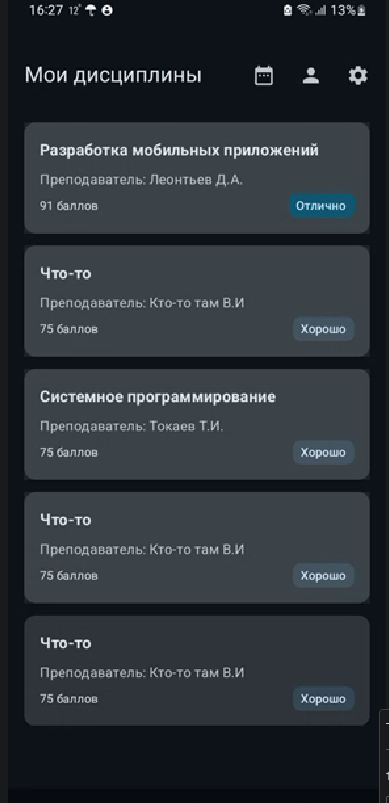
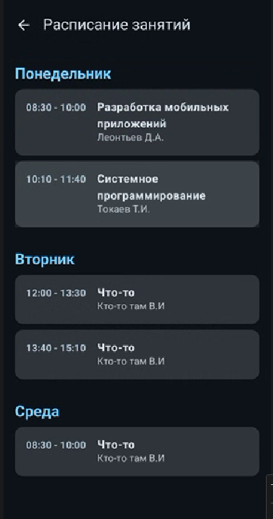
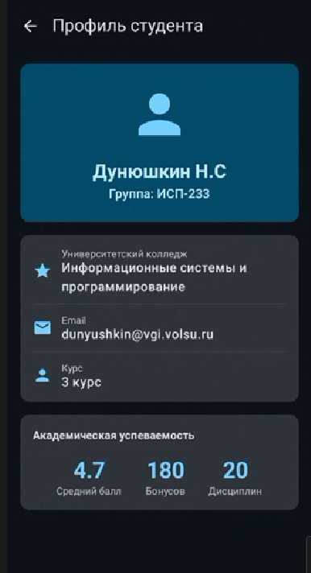
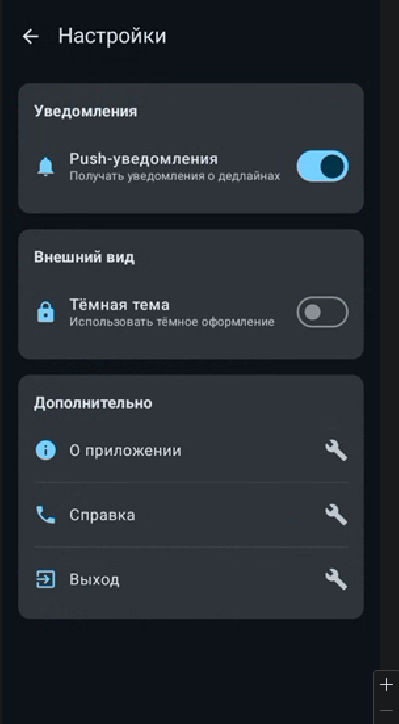

# Лабораторная работа №15-16. Navigation in Jetpack Compose
### Описание приложения
Приложение «Планировщик студента» предназначено для управления учебным процессом. Оно позволяет просматривать список текущих дисциплин, изучать подробную информацию по каждой из них (преподаватель, кредиты, описание), а также следить за расписанием занятий и настраивать профиль пользователя.

### Реализованные экраны
* **Главный экран (Home):** Список учебных дисциплин с краткой информацией.
* **Детали дисциплины (Details):** Подробное описание курса, данные о преподавателе и текущая оценка.
* **Расписание (Schedule/Raspis):** Список занятий, распределенный по дням недели.
* **Профиль (Profile):** Информация о студенте и статистика успеваемости.
* **Настройки (Settings):** Управление уведомлениями и темой оформления.

### Технологии
* **Язык:** Kotlin
* **UI-фреймворк:** Jetpack Compose
* **Навигация:** Navigation Compose (NavController, NavHost)
* **Компоненты Material 3:** Scaffold, TopAppBar, Cards, LazyColumn.

### Схема навигации
Приложение использует иерархическую структуру навигации:\
* **Home** (Стартовая точка)
    *  **Details** (переход по клику на карточку, передается `subjectId`)
    *  **Schedule** (переход по иконке календаря)
        *  **Details** (переход из расписания к конкретному предмету)
    *  **Profile** (переход по иконке пользователя)
    *  **Settings** (переход по иконке настроек)

### Скриншоты экранов

# Контрольные вопросы

### 1. Что такое NavController и для чего он используется?
* **Роль:** `NavController` — это центральный API для компонента Navigation. Он отслеживает, какой экран отображается в данный момент, управляет стеком назад (back stack) и выполняет команды перехода.
* **rememberNavController():** Важно создавать его через `rememberNavController()`, чтобы экземпляр контроллера сохранялся при рекомпозиции. Это гарантирует, что состояние навигации (например, история переходов) не будет сброшено при изменении состояния UI или повороте экрана.

### 2. Как передать параметр в маршрут навигации?
* **Процесс:**
    1.  **Определение:** В маршруте указывается плейсхолдер: `details/{subjectId}`.
    2.  **Передача:** При вызове `Maps` значение подставляется в строку: `navController.navigate("details/123")`.
    3.  **Извлечение:** В `NavHost` параметр извлекается из `NavBackStackEntry.arguments`.
* **Разница:** Обязательные параметры являются частью пути (`/path/{arg}`). Опциональные передаются как query-параметры (`/path?arg={arg}`) и требуют наличия значения по умолчанию или возможности быть `null`.

### 3. Зачем использовать sealed class для маршрутов?
* **Преимущества:** Использование `sealed class` (например, `Screen`) обеспечивает типобезопасность. Вместо того чтобы вручную писать строки везде, вы используете объекты. Это дает подсказки IDE и централизует описание всех путей.
* **Пример ошибки:** Без `sealed class` легко опечататься (например, написать `"detials"` вместо `"details"`), что приведет к крэшу приложения во время работы. С `Screen.Details.route` такая ошибка невозможна на этапе компиляции.

### 4. Что такое Back Stack и как им управлять?
* **Back Stack:** Это стек LIFO (Last In, First Out), в который помещаются экраны по мере навигации.
* **Схема:** `[Home]` -> `[Home, Profile]` -> `[Home, Profile, Settings]`.
* **popBackStack():** При вызове на экране Settings, он «выталкивается» из стека, и пользователю показывается предыдущий экран (Profile).

### 5. Как работает startDestination в NavHost?
* **Первый экран:** Это первый маршрут, который отрисовывает `NavHost` при инициализации. В данном проекте это `home`.
* **Динамика:** Изменить `startDestination` динамически напрямую нельзя, но можно программно перенаправить пользователя (например, с Splash-экрана на Login или Home) в зависимости от состояния (например, авторизован ли пользователь).

### 6. Что произойдёт, если навигировать на несуществующий маршрут?
* **Реакция:** `NavController` не найдет соответствия в `NavGraph` и выбросит исключение `IllegalArgumentException`, что приведет к завершению работы приложения.
* **Обработка:** Чтобы избежать этого, следует использовать только заранее определенные маршруты в `sealed class`. Также можно реализовать проверку маршрута перед переходом.

### 7. Зачем нужен параметр launchSingleTop в навигации?
* **Пример:** Если пользователь быстро нажмет на кнопку «Профиль» три раза, без `launchSingleTop` в стеке будет три копии экрана: `[Home, Profile, Profile, Profile]`.
* **Влияние:** `launchSingleTop = true` проверяет, находится ли целевой экран уже на вершине стека. Если да, то новая копия не создается, а используется существующая. Это предотвращает создание цепочки одинаковых экранов.
  """